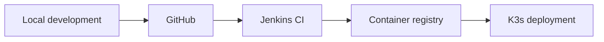

# Medical Visits DevOps

End-to-end DevOps project for a Java/JSP medical visit management application, from local development to automated deployment on a three-node K3s cluster.

> **Current status:** infrastructure baseline validated; repository and delivery workflow initialization in progress.

## Project objectives

This project demonstrates:

- source control and pull request workflow with GitHub;
- automated build and test execution with Jenkins;
- container image creation and security scanning;
- image publication to GitHub Container Registry;
- automated deployment to Kubernetes K3s;
- persistent MySQL storage with Longhorn;
- application health checks, rollback, and failure recovery;
- reproducible operations through documentation and runbooks.

## Application scope

The application is intentionally kept small so the project can focus on DevOps practices.

It provides:

- doctor management;
- patient management;
- medical visit management;
- patient search by code or name;
- CRUD operations implemented with Hibernate and MySQL;
- a JSP-based web interface.

Only fictitious demonstration data will be used.

## Target platform

| Component | Role |
|---|---|
| MacBook Pro M1 | Local development and Git client |
| GitHub | Source repository and collaboration workflow |
| Jenkins VM | Remote CI/CD builds |
| GitHub Container Registry | Container image registry |
| Three-node K3s cluster | Production-like deployment environment |
| Longhorn | Distributed persistent storage |
| MySQL | Application database |

## Delivery workflow



The planned pipeline performs:

1. source checkout;
2. compilation;
3. unit and integration tests;
4. WAR packaging;
5. container image build;
6. vulnerability scanning;
7. image publication;
8. K3s deployment;
9. post-deployment smoke tests.

## Repository structure

```text
.
├── app/                    # Java/JSP application
├── docker/                 # Container build configuration
├── deploy/
│   ├── compose/            # Local integration environment
│   └── kubernetes/         # K3s deployment resources
├── docs/
│   ├── architecture/       # Architecture and technical decisions
│   └── runbooks/           # Operational procedures
├── scripts/                # Automation scripts
├── Jenkinsfile             # CI/CD pipeline
└── README.md
```

Directories are introduced progressively when they contain an implemented component.

## Roadmap

- [x] Validate the three-node K3s infrastructure
- [x] Validate Longhorn nodes and default StorageClass
- [x] Prepare the dedicated Jenkins VM
- [x] Document the target architecture
- [ ] Implement the minimal application
- [ ] Add automated tests
- [ ] Build the container image
- [ ] Create the Jenkins CI pipeline
- [ ] Publish images to GHCR
- [ ] Deploy the application to K3s
- [ ] Add security and quality gates
- [ ] Validate rollback and node-failure recovery
- [ ] Produce operational runbooks

## Runtime evidence

Runtime evidence will be added only when it demonstrates an executed result that cannot be established from the source files alone, such as:

- a successful Jenkins pipeline;
- automated test reports;
- a running Kubernetes deployment;
- a successful security scan;
- application recovery after a node failure;
- a verified rollback.

## License

This project is licensed under the MIT License.