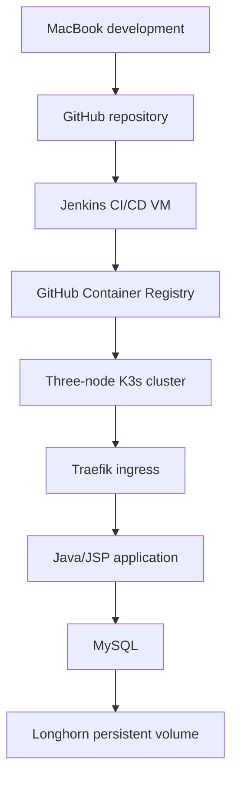

# Target Architecture

## Context

This project simulates an enterprise software delivery lifecycle on a local ARM64 laboratory. Development, continuous integration, container registry, Kubernetes deployment, and distributed storage are separated into distinct responsibilities.

## Infrastructure inventory

| Environment | Resources | Responsibility |
|---|---|---|
| MacBook Pro M1 | 32 GB RAM, 1 TB storage | Development, Docker, Git |
| Jenkins VM | Ubuntu Server ARM64, 8 GB RAM, 77 GB root volume | Remote builds and deployments |
| K3s node1 | Ubuntu 24.04 ARM64, 2 vCPU, 4 GB RAM | Control plane, etcd, workloads, Longhorn |
| K3s node2 | Ubuntu 24.04 ARM64, 2 vCPU, 4 GB RAM | Control plane, etcd, workloads, Longhorn |
| K3s node3 | Ubuntu 24.04 ARM64, 2 vCPU, 4 GB RAM | Control plane, etcd, workloads, Longhorn |

Each K3s node has a dedicated 30 GB disk mounted for Longhorn data.

## System architecture

## Deployment model

The production-like Kubernetes environment contains:

- a dedicated namespace;
- a replicated application Deployment;
- a ClusterIP Service;
- a Traefik Ingress;
- application health probes;
- ConfigMaps for non-sensitive configuration;
- Kubernetes Secrets for credentials;
- a MySQL workload with a Longhorn PersistentVolumeClaim;
- CPU and memory requests and limits.

## Delivery model

Jenkins runs outside the production cluster to avoid consuming its limited resources and to separate the build system from the deployment target.

The planned delivery process is:

1. retrieve source code from GitHub;
2. compile and test the application;
3. package the WAR artifact;
4. build an ARM64 container image;
5. scan the image for vulnerabilities;
6. publish the image to GHCR;
7. deploy the selected image to K3s;
8. execute post-deployment smoke tests;
9. preserve a rollback path.

## Architecture decisions

### K3s instead of a full Kubernetes distribution

K3s provides the Kubernetes capabilities required by the project while remaining suitable for three virtual machines with 4 GB RAM each.

### Jenkins outside K3s

The dedicated VM isolates build workloads from production workloads and demonstrates remote build execution.

### Longhorn for persistent storage

Longhorn distributes volume replicas across the three nodes and supports storage recovery demonstrations during a node failure.

### Traefik as ingress controller

Traefik is already integrated with K3s. Adding another ingress controller would consume unnecessary resources.

### Minimal application scope

The Java application remains deliberately small. The principal objective is to demonstrate automated delivery, containerization, orchestration, security controls, and operational recovery.

## Availability boundaries

Longhorn storage replication does not make MySQL itself a multi-instance database cluster. The initial design uses one MySQL instance with replicated persistent storage.

A node failure may therefore require:

- pod rescheduling;
- volume reattachment;
- MySQL crash recovery;
- application reconnection.

These recovery steps will be measured and documented during resilience testing.

## Security principles

- no secrets committed to Git;
- no real patient data;
- least-privilege access where possible;
- container vulnerability scanning;
- immutable versioned container images;
- deployment and rollback traceability.